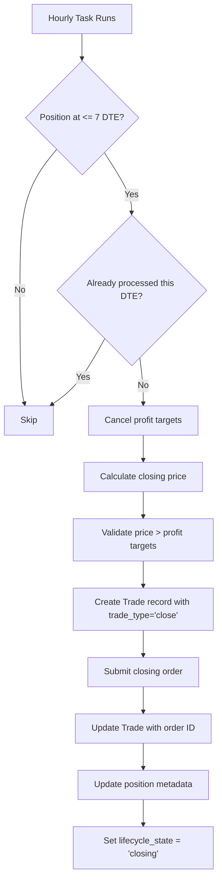

# DTE Management Pattern

## Overview

DTE (Days To Expiration) management is a critical risk management system that automatically closes positions as they approach expiration. The system transitions from profit-seeking to risk-elimination mode at 7 DTE, progressively escalating closing prices to ensure positions are closed before expiration.

## Philosophy: State-Based Reconciliation

The DTE management system follows a **state-based reconciliation** approach:

1. **Desired State**: Position closed before expiration (0 DTE)
2. **Current State**: Position with X days remaining
3. **Reconciliation**: System adjusts orders hourly to move toward desired state
4. **Escalation**: If orders don't fill, system becomes more aggressive each day

## Critical Requirements

### 1. REPLACE, Don't Create 

**CRITICAL**: DTE automation must CLOSE existing positions, NEVER create new ones.

#### The Problem
When submitting a closing order without proper linkage:
- TastyTrade interprets it as a NEW position opening
- Result: Duplicate positions instead of closing

#### The Solution
```python
# CREATE Trade record BEFORE submitting order
trade = await Trade.objects.acreate(
    position=position,              # Links to existing position
    trade_type="close",             # CRITICAL: Marks as closing
    lifecycle_event="dte_close",
    # ... other fields
)

# THEN submit the order
order_id = await execute_order_spec(order_spec)

# UPDATE Trade with actual order ID
trade.broker_order_id = order_id
await trade.asave()
```

### 2. Progressive Price Escalation

The system uses **progressive escalation** based on DTE to eliminate assignment risk:

#### Credit Spreads (e.g., sold put spread at $1.50 on $3 wide)
- **Max Loss**: $3.00 - $1.50 = $1.50
- **DTE 7**: Pay $1.50 (breakeven - entry price)
- **DTE 6**: Pay $2.55 (entry + 70% of max loss)
- **DTE 5**: Pay $2.70 (entry + 80% of max loss)
- **DTE 4**: Pay $2.85 (entry + 90% of max loss)
- **DTE ≤3**: Pay $3.00 (full spread width - accept max loss to guarantee exit)

**Formula**: `close_price = entry_price + (% × max_loss)`

**Rationale**: Assignment risk increases exponentially as DTE → 0. We prefer controlled losses over assignment complications.

#### Debit Spreads (e.g., bought put spread at $1.50 on $3 wide)
- **Max Loss**: $1.50 (lose entire debit paid)
- **Max Profit**: $3.00 - $1.50 = $1.50 (spread goes to full width)
- **DTE 7**: Sell for $1.50 (breakeven - entry price)
- **DTE 6**: Sell for $0.45 (entry - 70% of max loss)
- **DTE 5**: Sell for $0.30 (entry - 80% of max loss)
- **DTE 4**: Sell for $0.15 (entry - 90% of max loss)
- **DTE ≤3**: Sell for $0.00 (accept total loss to guarantee exit)

**Formula**: `sell_price = entry_price - (% × max_loss)` where `max_loss = entry_price`

### 3. Profit Target Validation

**Rule**: Closing price MUST be higher than cancelled profit targets.

```python
# Ensure we're closing for risk, not just hitting profit target
if cancelled_targets and is_credit_position:
    max_target_price = max(t["original_target_price"] for t in cancelled_targets.values())
    min_close_price = max_target_price * Decimal("1.10")  # 10% above profit target

    if limit_price < min_close_price:
        limit_price = min_close_price  # Adjust upward
```

### 4. Flexible Based on Filled Spreads

The system adapts to partially-filled positions:

- **All 3 spreads open** → Cancel all 3 profit targets, close all 3 spreads
- **2 spreads open** (1 filled) → Cancel 2 remaining targets, close 2 spreads
- **1 spread open** (2 filled) → Cancel last target, close last spread

### 5. State Tracking in Metadata

All DTE automation state is tracked in `position.metadata["dte_automation"]`:

```python
{
    "dte_automation": {
        "last_processed_dte": 7,
        "current_order_id": "123456",
        "current_limit_price": "1.40",
        "order_placed_at": "2025-10-31T12:00:00Z",
        "retry_count": 0,
        "last_error": null,
        "cancelled_profit_targets": {
            "call_spread": {
                "order_id": "410555945",
                "original_target_price": "1.00",
                "original_percent": 50,
                "cancelled_at": "2025-10-31T12:00:00Z",
                "reason": "dte_replacement_7"
            }
        }
    }
}
```

## Implementation Flow

### Hourly DTE Task Execution



### Daily Escalation

```mermaid
graph LR
    A[DTE 7: Breakeven] --> B[Order doesn't fill]
    B --> C[DTE 6: +70% max loss]
    C --> D[Order doesn't fill]
    D --> E[DTE 5: +80% max loss]
    E --> F[Order doesn't fill]
    F --> G[DTE 4: +90% max loss]
    G --> H[Order doesn't fill]
    H --> I[DTE ≤3: Full spread width]
```



## Idempotency & Retry Logic

### Idempotency
- Won't replace order at same DTE if still working
- Checks `last_processed_dte` in metadata
- Only processes each DTE level once per position

### Retry Logic
- Maximum 3 retries per DTE level
- Tracks retry count in metadata
- Sends notification after 3 failed attempts
- Waits for next hourly run before retrying

## Example: Full Position Lifecycle

```
Sep 25 (45 DTE): Open Bull Put Spread
    - $3 wide spread, received $1.50 credit
    - Max loss = $1.50
    - Place profit target at 40% ($0.90 debit to close)

Oct 31 (7 DTE): DTE Management begins
    - Cancel profit target order
    - Create Trade with trade_type="close"
    - Place closing order at $1.50 (breakeven)

Nov 1 (6 DTE): Order didn't fill
    - Cancel previous order
    - Place new order at $2.55 (entry + 70% of max loss)

Nov 2 (5 DTE): Order didn't fill
    - Cancel previous order
    - Place new order at $2.70 (entry + 80% of max loss)

Nov 3 (4 DTE): Order fills at $2.70
    - Position closed with $1.20 loss
    - Avoided assignment risk
```

## Common Issues & Solutions

### Issue 1: Creating New Positions Instead of Closing

**Symptom**: Order #417895808 created as NEW position with $0.10 bid

**Cause**: Order submitted without Trade record linking to position

**Solution**: Create Trade with `trade_type="close"` BEFORE submitting order

### Issue 2: Closing Price Too Low

**Symptom**: Closing order at $0.10 when should be $1.40

**Cause**: `position.avg_price` is 0 or null

**Solution**:
- Check data integrity of avg_price
- Add validation and logging
- Use default spread_width if missing

### Issue 3: Profit Targets Not Cancelled

**Symptom**: Both closing order and profit targets active

**Cause**: Using stale `child_order_ids` instead of `profit_target_details`

**Solution**: Use `profit_target_details` as source of truth

## Testing Requirements

### Unit Tests
1. **No new positions created**: Verify Trade.trade_type = "close"
2. **Price escalation**: Test each DTE level pricing
3. **Profit target validation**: Ensure close price > profit target
4. **State tracking**: Verify metadata updates correctly

### Integration Tests
1. Full DTE lifecycle from 7 → 3 DTE
2. Partial position closing (some spreads already filled)
3. Retry logic on order rejection
4. Notification on max retries

### Manual Verification
1. Monitor first 5 production DTE closures
2. Verify no duplicate positions created
3. Check pricing matches escalation schedule
4. Confirm profit targets cancelled before closing

## Configuration

### Settings
```python
# DTE threshold to start risk management
DTE_RISK_MANAGEMENT_THRESHOLD = 7

# Price escalation for CREDIT spreads
# Formula: close_price = entry_price + (% × max_loss)
DTE_ESCALATION_CREDIT = {
    7: 0.00,  # Breakeven (entry price only)
    6: 0.70,  # Entry + 70% of max loss
    5: 0.80,  # Entry + 80% of max loss
    4: 0.90,  # Entry + 90% of max loss
    3: 1.00,  # Full spread width (max loss)
}

# Price escalation for DEBIT spreads
# Formula: sell_price = entry_price - (% × max_loss)
# where max_loss = entry_price (lose entire debit paid)
DTE_ESCALATION_DEBIT = {
    7: 0.00,  # Breakeven (entry price - 0%)
    6: 0.70,  # Entry - 70% of max loss (accept 70% loss)
    5: 0.80,  # Entry - 80% of max loss (accept 80% loss)
    4: 0.90,  # Entry - 90% of max loss (accept 90% loss)
    3: 1.00,  # Entry - 100% = $0.00 (accept total loss)
}
```

## Monitoring & Alerts

### Key Metrics
- Positions at/below 7 DTE
- Successful DTE closures
- Failed closing attempts
- Average fill price vs target

### Alert Conditions
- Position at 3 DTE without closing order
- 3+ failed attempts at same DTE
- Closing price validation failures
- New position created during DTE close (CRITICAL)

## Future Enhancements

1. **Broker API "Reduce Only" Support**
   - Add position linkage to orders
   - Ensure orders marked as closing

2. **Dynamic Escalation**
   - Adjust percentages based on volatility
   - Consider market conditions

3. **Multi-Strategy Support**
   - Different escalation for different strategies
   - Configurable per-position overrides

## Related Documentation

- [PROFIT_TARGET_LIFECYCLE.md](PROFIT_TARGET_LIFECYCLE.md) - Profit target management
- [SENEX_TRIDENT_STRATEGY_DEFINITION.md](../specifications/SENEX_TRIDENT_STRATEGY_DEFINITION.md) - Strategy details
- [ADR-DTE-CLOSING-ORDERS.md](../architecture/ADR-DTE-CLOSING-ORDERS.md) - Architecture decision