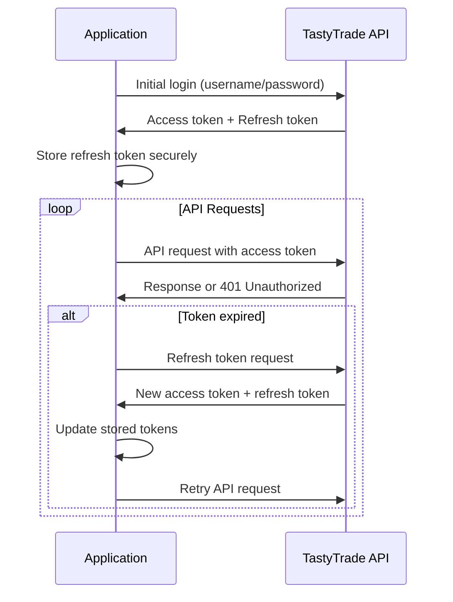

# TastyTrade Authentication Guide

**Authentication Method**: OAuth 2.0 with refresh tokens
**Security**: HTTPS required for all authentication requests

## Authentication Flow Overview



## Initial Authentication

### Username/Password Login (First Time Only)
```python
from tastytrade import OAuthSession

# Initial authentication with credentials
session = OAuthSession(
    username='your_username',
    password='your_password',
    is_test=True  # True for sandbox, False for production
)

# Extract tokens for secure storage
access_token = session.access_token
refresh_token = session.refresh_token

print(f"Access Token: {access_token[:20]}...")  # Don't log full token
print(f"Refresh Token: {refresh_token[:20]}...")  # Don't log full token

# Store refresh token securely (see Django integration below)
```

### Token-Based Authentication (Recommended)
```python
# Subsequent authentications using stored refresh token
session = OAuthSession(
    provider_secret='your_client_secret',
    refresh_token='stored_refresh_token',
    is_test=True
)

# Validate session
if hasattr(session, 'validate'):
    is_valid = session.validate()
    print(f"Session valid: {is_valid}")
```

## Django Integration

### Secure Token Storage
```python
# models.py
from django.db import models
from django.contrib.auth import get_user_model
from django_cryptography.fields import encrypt
from django.core.serializers.json import DjangoJSONEncoder

User = get_user_model()

class TastyTradeCredentials(models.Model):
    user = models.OneToOneField(
        User, 
        on_delete=models.CASCADE,
        related_name='tastytrade_credentials'
    )
    
    # Encrypted token storage
    refresh_token = encrypt(models.TextField())
    client_secret = encrypt(models.TextField())
    
    # Account information
    account_number = models.CharField(max_length=50)
    is_test_account = models.BooleanField(default=True)
    
    # Token metadata
    token_created_at = models.DateTimeField(auto_now_add=True)
    token_updated_at = models.DateTimeField(auto_now=True)
    last_validated_at = models.DateTimeField(null=True, blank=True)
    
    # Additional account data (encrypted JSON)
    account_data = encrypt(
        models.JSONField(default=dict, encoder=DjangoJSONEncoder)
    )
    
    class Meta:
        verbose_name = "TastyTrade Credentials"
        verbose_name_plural = "TastyTrade Credentials"
    
    def __str__(self):
        return f"{self.user.username} - {self.account_number}"
```

### Authentication Service
```python
# services/tastytrade_auth.py
from django.conf import settings
from tastytrade import OAuthSession
from tastytrade.exceptions import TastyTradeError
from .models import TastyTradeCredentials
from datetime import datetime, timedelta
import logging

logger = logging.getLogger(__name__)

class TastyTradeAuthService:
    """
    Service for managing TastyTrade authentication
    """
    
    @staticmethod
    def create_session_for_user(user):
        """Create authenticated session for user"""
        try:
            credentials = TastyTradeCredentials.objects.get(user=user)
            
            session = OAuthSession(
                provider_secret=credentials.client_secret,
                refresh_token=credentials.refresh_token,
                is_test=credentials.is_test_account
            )
            
            # Update last validated timestamp
            credentials.last_validated_at = datetime.now()
            credentials.save(update_fields=['last_validated_at'])
            
            return session
            
        except TastyTradeCredentials.DoesNotExist:
            logger.warning(f"No TastyTrade credentials found for user {user.id}")
            return None
        
        except TastyTradeError as e:
            logger.error(f"TastyTrade authentication failed for user {user.id}: {e}")
            return None
    
    @staticmethod
    def store_initial_credentials(user, username, password, client_secret, is_test=True):
        """Store initial credentials after first login"""
        try:
            # Perform initial authentication
            session = OAuthSession(
                username=username,
                password=password,
                is_test=is_test
            )
            
            # Get account information
            from tastytrade import Customer
            customer = Customer.get_me(session)
            primary_account = customer.accounts[0] if customer.accounts else None
            
            # Store credentials
            credentials, created = TastyTradeCredentials.objects.get_or_create(
                user=user,
                defaults={
                    'refresh_token': session.refresh_token,
                    'client_secret': client_secret,
                    'account_number': primary_account.account_number if primary_account else '',
                    'is_test_account': is_test,
                    'account_data': {
                        'customer_id': customer.id,
                        'username': username,
                        'accounts': [{
                            'account_number': acc.account_number,
                            'account_type': acc.account_type,
                            'nickname': acc.nickname
                        } for acc in customer.accounts]
                    }
                }
            )
            
            if not created:
                # Update existing credentials
                credentials.refresh_token = session.refresh_token
                credentials.client_secret = client_secret
                credentials.account_number = primary_account.account_number if primary_account else credentials.account_number
                credentials.is_test_account = is_test
                credentials.save()
            
            logger.info(f"TastyTrade credentials stored for user {user.id}")
            return credentials
            
        except TastyTradeError as e:
            logger.error(f"Failed to store TastyTrade credentials for user {user.id}: {e}")
            raise
    
    @staticmethod
    def refresh_user_tokens(user):
        """Manually refresh tokens for user"""
        try:
            credentials = TastyTradeCredentials.objects.get(user=user)
            
            session = OAuthSession(
                provider_secret=credentials.client_secret,
                refresh_token=credentials.refresh_token,
                is_test=credentials.is_test_account
            )
            
            # Force token refresh
            session.refresh()
            
            # Update stored tokens
            credentials.refresh_token = session.refresh_token
            credentials.token_updated_at = datetime.now()
            credentials.save(update_fields=['refresh_token', 'token_updated_at'])
            
            logger.info(f"Tokens refreshed for user {user.id}")
            return True
            
        except Exception as e:
            logger.error(f"Token refresh failed for user {user.id}: {e}")
            return False
    
    @staticmethod
    def validate_user_session(user):
        """Validate that user's session is working"""
        session = TastyTradeAuthService.create_session_for_user(user)
        if not session:
            return False
        
        try:
            # Test the session with a simple API call
            from tastytrade import Customer
            customer = Customer.get_me(session)
            return customer is not None
            
        except Exception as e:
            logger.warning(f"Session validation failed for user {user.id}: {e}")
            return False
```

### Authentication Middleware
```python
# middleware/tastytrade_auth.py
from django.http import JsonResponse
from .services.tastytrade_auth import TastyTradeAuthService

class TastyTradeAuthMiddleware:
    """
    Middleware to ensure TastyTrade session is available for authenticated users
    """
    
    def __init__(self, get_response):
        self.get_response = get_response
    
    def __call__(self, request):
        # Only process for authenticated users accessing trading endpoints
        if (request.user.is_authenticated and 
            request.path.startswith('/api/trading/')):
            
            # Create TastyTrade session
            tt_session = TastyTradeAuthService.create_session_for_user(request.user)
            
            if not tt_session:
                return JsonResponse({
                    'error': 'TastyTrade authentication required',
                    'code': 'tt_auth_required'
                }, status=401)
            
            # Attach session to request
            request.tastytrade_session = tt_session
        
        response = self.get_response(request)
        return response
```

## Token Management

### Automatic Token Refresh
```python
# utils/session_manager.py
from tastytrade import OAuthSession
from tastytrade.exceptions import TastyTradeError
import asyncio
import time

class SessionManager:
    """
    Manages TastyTrade sessions with automatic token refresh
    """
    
    def __init__(self, credentials):
        self.credentials = credentials
        self.session = None
        self.last_refresh = 0
        self.refresh_threshold = 3600  # 1 hour
    
    def get_session(self):
        """Get session, refreshing if necessary"""
        now = time.time()
        
        # Create session if doesn't exist
        if not self.session:
            self.session = self._create_session()
            self.last_refresh = now
        
        # Refresh if threshold exceeded
        elif now - self.last_refresh > self.refresh_threshold:
            try:
                self.session.refresh()
                self.last_refresh = now
                
                # Update stored refresh token
                self.credentials.refresh_token = self.session.refresh_token
                self.credentials.save(update_fields=['refresh_token'])
                
            except Exception as e:
                # Create new session if refresh fails
                self.session = self._create_session()
                self.last_refresh = now
        
        return self.session
    
    def _create_session(self):
        """Create new session from stored credentials"""
        return OAuthSession(
            provider_secret=self.credentials.client_secret,
            refresh_token=self.credentials.refresh_token,
            is_test=self.credentials.is_test_account
        )
    
    async def call_api_with_retry(self, api_func, *args, **kwargs):
        """Call API function with automatic retry on auth failure"""
        session = self.get_session()
        
        try:
            if asyncio.iscoroutinefunction(api_func):
                return await api_func(session, *args, **kwargs)
            else:
                return api_func(session, *args, **kwargs)
        
        except TastyTradeError as e:
            if e.status_code == 401:  # Unauthorized
                # Force token refresh and retry
                self.session.refresh()
                self.last_refresh = time.time()
                
                if asyncio.iscoroutinefunction(api_func):
                    return await api_func(self.session, *args, **kwargs)
                else:
                    return api_func(self.session, *args, **kwargs)
            else:
                raise

# Usage
manager = SessionManager(user_credentials)
account = await manager.call_api_with_retry(Account.a_get, account_number)
```

### Token Expiration Monitoring
```python
# management/commands/monitor_tokens.py
from django.core.management.base import BaseCommand
from django.utils import timezone
from datetime import timedelta
from myapp.models import TastyTradeCredentials
from myapp.services.tastytrade_auth import TastyTradeAuthService

class Command(BaseCommand):
    help = 'Monitor and refresh TastyTrade tokens'
    
    def add_arguments(self, parser):
        parser.add_argument(
            '--refresh-threshold',
            type=int,
            default=24,
            help='Hours before refreshing tokens'
        )
    
    def handle(self, *args, **options):
        threshold_hours = options['refresh_threshold']
        threshold = timezone.now() - timedelta(hours=threshold_hours)
        
        # Find credentials that need refresh
        credentials_to_refresh = TastyTradeCredentials.objects.filter(
            token_updated_at__lt=threshold
        )
        
        self.stdout.write(
            f"Found {credentials_to_refresh.count()} credentials to refresh"
        )
        
        for credentials in credentials_to_refresh:
            try:
                success = TastyTradeAuthService.refresh_user_tokens(credentials.user)
                if success:
                    self.stdout.write(
                        self.style.SUCCESS(f"Refreshed tokens for {credentials.user.username}")
                    )
                else:
                    self.stdout.write(
                        self.style.ERROR(f"Failed to refresh tokens for {credentials.user.username}")
                    )
            except Exception as e:
                self.stdout.write(
                    self.style.ERROR(f"Error refreshing {credentials.user.username}: {e}")
                )

# Run as cron job:
# 0 */6 * * * python manage.py monitor_tokens
```

## Production Security Considerations

### Environment Configuration
```python
# settings.py

# TastyTrade API Settings
TASTYTRADE_BASE_URL = env('TASTYTRADE_BASE_URL', default='https://api.cert.tastyworks.com')
TASTYTRADE_IS_TEST = env.bool('TASTYTRADE_IS_TEST', default=True)
TASTYTRADE_CLIENT_SECRET = env('TASTYTRADE_CLIENT_SECRET')  # Required

# Security settings
TASTYTRADE_TOKEN_REFRESH_THRESHOLD = env.int('TASTYTRADE_TOKEN_REFRESH_THRESHOLD', default=3600)
TASTYTRADE_MAX_RETRY_ATTEMPTS = env.int('TASTYTRADE_MAX_RETRY_ATTEMPTS', default=3)

# Logging
LOGGING = {
    'loggers': {
        'tastytrade': {
            'handlers': ['file'],
            'level': 'INFO',
            'propagate': False,
        },
        'services.tastytrade_auth': {
            'handlers': ['file'],
            'level': 'INFO',
            'propagate': False,
        },
    },
}
```

### Security Best Practices

#### 1. Token Storage
```python
# Use encrypted fields for sensitive data
from django_cryptography.fields import encrypt

class SecureCredentials(models.Model):
    # Never store in plain text
    refresh_token = encrypt(models.TextField())
    client_secret = encrypt(models.TextField())
    
    # Avoid logging sensitive data
    def __str__(self):
        return f"Credentials for {self.user.username} (***)"
```

#### 2. Audit Logging
```python
# services/audit_log.py
import logging
from django.contrib.auth.signals import user_logged_in, user_logged_out
from django.dispatch import receiver

audit_logger = logging.getLogger('security.audit')

@receiver(user_logged_in)
def log_user_login(sender, request, user, **kwargs):
    audit_logger.info(f"User login: {user.username} from {request.META.get('REMOTE_ADDR')}")

def log_tt_auth_event(user, event_type, success=True, error=None):
    """Log TastyTrade authentication events"""
    audit_logger.info(f"TT Auth {event_type}: {user.username} - {'SUCCESS' if success else 'FAILURE'}")
    if error:
        audit_logger.warning(f"TT Auth Error for {user.username}: {error}")
```

#### 3. Rate Limiting
```python
# utils/rate_limiter.py
from django.core.cache import cache
from django.http import JsonResponse
from functools import wraps
import time

def rate_limit_tt_auth(max_attempts=5, window=300):  # 5 attempts per 5 minutes
    def decorator(func):
        @wraps(func)
        def wrapper(request, *args, **kwargs):
            if not request.user.is_authenticated:
                return func(request, *args, **kwargs)
            
            key = f"tt_auth_attempts:{request.user.id}"
            attempts = cache.get(key, 0)
            
            if attempts >= max_attempts:
                return JsonResponse({
                    'error': 'Too many authentication attempts',
                    'retry_after': window
                }, status=429)
            
            try:
                response = func(request, *args, **kwargs)
                # Reset counter on success
                if response.status_code < 400:
                    cache.delete(key)
                return response
            
            except Exception as e:
                # Increment counter on failure
                cache.set(key, attempts + 1, window)
                raise
        
        return wrapper
    return decorator
```

## Testing Authentication

### Unit Tests
```python
# tests/test_tastytrade_auth.py
from django.test import TestCase
from django.contrib.auth import get_user_model
from unittest.mock import patch, MagicMock
from services.tastytrade_auth import TastyTradeAuthService
from models import TastyTradeCredentials

User = get_user_model()

class TastyTradeAuthServiceTest(TestCase):
    def setUp(self):
        self.user = User.objects.create_user(
            username='testuser',
            email='test@example.com',
            password='testpass123'
        )
    
    @patch('services.tastytrade_auth.OAuthSession')
    def test_create_session_for_user(self, mock_oauth):
        # Create test credentials
        credentials = TastyTradeCredentials.objects.create(
            user=self.user,
            refresh_token='test_refresh_token',
            client_secret='test_client_secret',
            account_number='TEST123',
            is_test_account=True
        )
        
        # Mock successful session creation
        mock_session = MagicMock()
        mock_oauth.return_value = mock_session
        
        # Test session creation
        session = TastyTradeAuthService.create_session_for_user(self.user)
        
        self.assertIsNotNone(session)
        mock_oauth.assert_called_once_with(
            provider_secret='test_client_secret',
            refresh_token='test_refresh_token',
            is_test=True
        )
    
    def test_create_session_no_credentials(self):
        # Test without credentials
        session = TastyTradeAuthService.create_session_for_user(self.user)
        self.assertIsNone(session)
    
    @patch('services.tastytrade_auth.OAuthSession')
    @patch('services.tastytrade_auth.Customer')
    def test_store_initial_credentials(self, mock_customer, mock_oauth):
        # Mock successful authentication
        mock_session = MagicMock()
        mock_session.refresh_token = 'new_refresh_token'
        mock_oauth.return_value = mock_session
        
        # Mock customer data
        mock_account = MagicMock()
        mock_account.account_number = 'TEST123'
        mock_account.account_type = 'Individual'
        mock_account.nickname = 'Test Account'
        
        mock_customer_obj = MagicMock()
        mock_customer_obj.id = 'CUSTOMER123'
        mock_customer_obj.accounts = [mock_account]
        mock_customer.get_me.return_value = mock_customer_obj
        
        # Test credential storage
        credentials = TastyTradeAuthService.store_initial_credentials(
            user=self.user,
            username='testuser',
            password='testpass',
            client_secret='client_secret',
            is_test=True
        )
        
        self.assertIsNotNone(credentials)
        self.assertEqual(credentials.user, self.user)
        self.assertEqual(credentials.account_number, 'TEST123')
        self.assertTrue(credentials.is_test_account)
```

### Integration Tests
```python
# tests/test_authentication_flow.py
from django.test import TestCase, override_settings
from django.contrib.auth import get_user_model
from django.urls import reverse
import json

User = get_user_model()

@override_settings(TASTYTRADE_IS_TEST=True)
class AuthenticationFlowTest(TestCase):
    def setUp(self):
        self.user = User.objects.create_user(
            username='testuser',
            email='test@example.com',
            password='testpass123'
        )
    
    def test_setup_tastytrade_auth_view(self):
        self.client.force_login(self.user)
        
        response = self.client.post(reverse('setup_tastytrade_auth'), {
            'username': 'tt_username',
            'password': 'tt_password',
            'client_secret': 'client_secret'
        })
        
        # Should redirect on success or show form errors
        self.assertIn(response.status_code, [200, 302])
    
    def test_trading_api_requires_auth(self):
        self.client.force_login(self.user)
        
        # Should require TastyTrade auth
        response = self.client.get(reverse('api:trading:account_balance'))
        self.assertEqual(response.status_code, 401)
        
        data = json.loads(response.content)
        self.assertEqual(data['code'], 'tt_auth_required')
```

This comprehensive authentication guide provides all the patterns needed for secure, production-ready TastyTrade API integration with Django applications.